# IEEE-CIS Fraud Detection Production Pipeline

## 🎯 Overview

Production-grade fraud detection pipeline that strictly separates model ranking from business decision logic. Core principles: (1) Ranking ≠ Decision — AUC computed on probabilities only, business metrics evaluated on thresholded decisions; (2) Hard-constrained optimizer — enforces strict business limits (recall, review rate, false decline) via percentile grid search with hard filtering, not heuristics; (3) Zero-breaking-change API — backward compatible signatures, safe for incremental updates without breaking existing deployments.

## 🏗️ Architecture

```mermaid
graph LR
    A[Data<br/>transaction + identity] --> B[Temporal Split<br/>70/15/15]
    B --> C[Feature Engineering]
    C --> D[Frequency Encoding<br/>train only]
    D --> E[Temporal Features]
    E --> F[LightGBM Training]
    F --> G[Raw Probabilities]
    G --> H[Constraint Optimizer<br/>percentile grid + hard filter]
    H --> I[3-Tier Decision Engine<br/>APPROVE/REVIEW/BLOCK]
    I --> J[Deployment]

    style A fill:#e1f5ff
    style B fill:#fff4e1
    style C fill:#e1f5ff
    style D fill:#fff4e1
    style E fill:#e1f5ff
    style F fill:#fff4e1
    style G fill:#ffe1f5
    style H fill:#e1ffe1
    style I fill:#ffe1e1
    style J fill:#e1e1ff
```



Calibration is isolated and opt-in (not used in decision layer by default). Feature store handles historical aggregation for low-latency inference. Evaluation pipeline explicitly separates `ranking_metrics` (model quality: ROC-AUC, PR-AUC) from `system_metrics` (business impact: recall_total, review_rate, false_decline_rate).

## 📊 Baseline Performance

| Layer | Metric | Value | Note |
|---|---|---|---|
| Ranking | ROC-AUC | 0.8853 | Probability ranking quality |
| Ranking | PR-AUC | 0.4808 | Expected at ~3.6% fraud rate |
| Decision | recall_total | 0.784 | Fraud caught via BLOCK + REVIEW |
| Decision | fraud_capture_rate | 0.402 | Fraud AUTO-BLOCKED only |
| Decision | review_rate | 0.192 | Manual queue load |
| Decision | false_decline_rate | 0.018 | Good users incorrectly blocked |

`fraud_capture_rate` (40%) and `recall_total` (78%) differ by design: auto-block targets precision to minimize false declines, while review captures uncertain fraud. The gap is intentional to limit customer friction while maintaining high total fraud capture.

## ⚙️ Decision System & Constraint Optimization

3-tier mapping: `prob >= t_block → BLOCK`, `t_review <= prob < t_block → REVIEW`, else `APPROVE`. Optimizer searches percentile grid (5th-95th percentiles), HARD filters out pairs violating constraints, selects highest recall → lowest review rate as tiebreaker. Default constraints: `min_recall ≥ 0.60`, `max_review_rate ≤ 0.20`, `max_false_decline_rate ≤ 0.02`. Fallback behavior: if no pair satisfies constraints, logs warning and deploys best feasible pair (never silently violates limits).

## 🚀 Quick Start

```bash
dvc pull #fetch data
uv run python -m src.pipeline.ieee_cis_pipeline
```

Expected console output:

```
================================================================================
IEEE-CIS FRAUD DETECTION - PRODUCTION PIPELINE
================================================================================
2026-05-18 20:19:19,371 | INFO     | 🚀 PIPELINE START
2026-05-18 20:19:45,705 | INFO     | Split: train=413378, val=88581, test=44291
...
2026-05-18 20:22:10,921 | INFO     | 📊 Ranking (val): ROC-AUC=0.8853, PR-AUC=0.4808
2026-05-18 20:22:24,128 | INFO     | ⚙️ Thresholds: t_review=0.3213, t_block=0.7184
2026-05-18 20:22:24,128 | INFO     | 🎯 System (test): recall_total=0.7838, review_rate=0.1924
...
✅ Pipeline completed successfully.

📈 Ranking Metrics (Model Quality):
   roc_auc: 0.8853
   pr_auc: 0.4808
   mean_prob: 0.2714
   std_prob: 0.2068
   min_prob: 0.0233
   max_prob: 0.9942

🎯 System Metrics (Business Impact):
   approve_rate: 0.7794
   review_rate: 0.1924
   decline_rate: 0.0282
   fraud_capture_rate: 0.4019
   false_decline_rate: 0.0182
   review_legit_rate: 0.1874
   fraud_in_approve: 248
   fraud_in_review: 438
   fraud_in_decline: 461
   recall_total: 0.7838
   utility_score: 5472.7359

🔑 Deployed Thresholds:
   Review: ≥0.3213
   Block:  ≥0.7184
```

No CLI flags required for default run; paths default to `data/raw/train_*.csv`.

## 🔧 Configuration & Tuning

Adjust constraints in `FraudDecisionSystem.fit()`:

```python
decision_system = FraudDecisionSystem()
threshold_info = decision_system.fit(
    y_val, val_probs,
    target_recall=0.80,
    max_review_rate=0.20,
    max_false_decline_rate=0.02
)
```

Trade-off table:

| Goal | Parameter Change | Expected Impact |
|---|---|---|
| Catch more fraud | `min_recall=0.70` | ↑ recall_total, ↑ review_rate |
| Reduce ops load | `max_review_rate=0.15` | ↓ review_rate, ↓ recall_total |
| Protect customers | `max_false_decline_rate=0.015` | ↓ FD rate, ↓ auto-block |

Warning: aggressive threshold lowering will increase false declines; 3-tier system exists to avoid this trade-off by routing uncertain cases to manual review.

## 🛡️ Production Deployment Checklist

- Export configuration: `thresholds`, `feature_cols`, `baseline_metrics` to version-controlled artifact
- Run shadow mode for 48 hours: compare pipeline decisions against legacy system on live traffic
- Verify constraint adherence on live traffic: monitor `recall_total`, `review_rate`, `false_decline_rate` in production
- Set up monitoring alerts for drift: PSI on feature distributions, AUC degradation > 0.02
- Schedule monthly retrain with temporal split to maintain performance

## 🐛 Troubleshooting

| Error | Cause | Fix |
|---|---|---|
| `feature_names missing` | DataFrame columns lost during concat | Ensure `X_train.columns = feature_cols` before training |
| `Constraints met: False` | Validation distribution temporarily infeasible | Relax one constraint temporarily, check for data drift |
| `DeviceInfo dropped` | Feature store schema mismatch | Add `expected_cols` validation in `build_full_store()` |
| AUC ~0.50 | Passed binary predictions to ranking metrics | Pass `y_pred_proba` (floats), not `y_pred` (0/1) |
